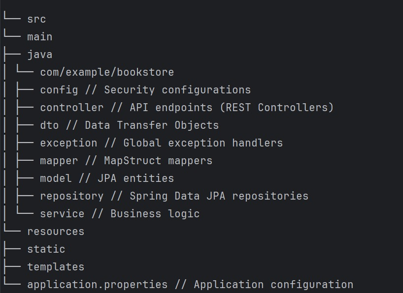

# RESTful Bookstore API

<p align="center">
  
</p>

<p align="center">
  A professional-grade, production-ready REST API for managing a bookstore's collection of books and authors.
</p>

<p align="center">
    <a href="https://github.com/bharatjaiswal856/bookstore-api.git"></a>
    <a href="#"></a>
    <a href="https://www.java.com"></a>
    <a href="https://spring.io/projects/spring-boot"></a>
    <a href="https://maven.apache.org/"></a>
</p>

---

## Overview

This project is a complete backend solution built with **Java and Spring Boot**. It demonstrates best practices in modern API development, including a clean, layered architecture, robust security, and comprehensive documentation. It serves as an excellent reference for building scalable and maintainable enterprise-level applications.

## Core Features

| Feature                  | Description                                                                                                                           |
| ------------------------ | ------------------------------------------------------------------------------------------------------------------------------------- |
| **Layered Architecture** | Clean separation of concerns (Controller, Service, Repository) for maintainability and testability.                                   |
| **DTO Pattern**          | Utilizes Data Transfer Objects to create a stable API contract, decoupling it from the internal database model.                         |
| **CRUD Operations**      | Full Create, Read, Update, and Delete functionality for both **Books** and **Authors**.                                                 |
| **Pagination & Sorting** | Efficiently handle large datasets with paginated and sorted responses (e.g., `?page=0&size=5&sort=title,asc`).                          |
| **Robust Security**      | Secured with **Spring Security** using HTTP Basic Authentication. Differentiated access levels for read and write operations.         |
| **Input Validation**     | Server-side validation of incoming requests to ensure data integrity and prevent invalid data from entering the system.                 |
| **Exception Handling**   | A centralized global exception handler provides consistent and informative error responses.                                           |
| **API Documentation**    | Automatically generated and interactive API documentation with **Swagger UI (Springdoc)**.                                            |
| **In-Memory Database**   | Uses **H2 Database** for a lightweight, zero-configuration development experience. The database state resets on each application restart. |
| **Mapper Utility**       | Leverages **MapStruct** for high-performance, boilerplate-free mapping between DTOs and JPA Entities.                                 |

---

## Tech Stack

| Category         | Technology / Library                                                                                   |
| ---------------- | ------------------------------------------------------------------------------------------------------ |
| **Language**     |                     |
| **Framework**    |  |
| **Build Tool**   |               |
| **Database**     |                      |
| **Data Access**  |                |
| **API & Docs**   |      |
| **Security**     | |
| **Utilities**    | `Lombok`, `MapStruct`                                                                                  |

---

## Getting Started

Follow these instructions to get the project up and running on your local machine.

### Prerequisites

- [**Java JDK 21**](https://www.oracle.com/java/technologies/downloads/#java21) or newer.
- [**Apache Maven 3.9**](https://maven.apache.org/download.cgi) or newer.
- [**Git**](https://git-scm.com/downloads) for cloning the repository.
- An IDE like IntelliJ IDEA or VS Code is recommended.

### Installation & Execution

1. **Clone the repository:**
   ```bash
   git clone https://github.com/bharatjaiswal856/bookstore-api.git
   
2. **Navigate into the project directory:**
   ```bash
   cd bookstore-api
3. **Run the application:**
   ```bash
   mvnw spring-boot:run

## API Usage

Once running, the API provides several resources for interacting with the application.

### Important URLs

- **API Base URL:** `http://localhost:8080`
- **Swagger UI (Interactive Docs):** [http://localhost:8080/swagger-ui.html](http://localhost:8080/swagger-ui.html)
- **H2 Database Console:** [http://localhost:8080/h2-console](http://localhost:8080/h2-console)
    - **JDBC URL:** `jdbc:h2:mem:bookstoredb`
    - **User Name:** `sa`
    - **Password:** *(leave this field blank)*

### Authentication

This API uses **HTTP Basic Authentication**.
To use protected endpoints (like `POST` or `DELETE`), you must provide credentials. In the Swagger UI, click the `Authorize` button and enter one of the pre-configured users:

| Role        | Username    | Password    | Permissions                            |
| ----------- | ----------- | ----------- | -------------------------------------- |
| **Admin**   | `admin`     | `password`  | Full CRUD access (Read, Create, Update, Delete) |
| **User**    | `user`      | `password`  | Read-Only access (`GET` requests)      |


### Example API Workflow

1. **Authorize as `admin`** in the Swagger UI.
2. **Create an author** using `POST /api/authors`. Note the `id` from the response.
3. **Create a book** using `POST /api/books`, referencing the `authorId` you just created.
4. **Log out** by clicking `Authorize -> Logout`.
5. **View all books** using the public `GET /api/books` endpoint. You should see the book you added.
6. **Attempt to delete a book** using `DELETE /api/books/{id}`. You will receive a `401 Unauthorized` error because you are not authenticated as an admin.

---

## Project Structure

The project follows a standard layered architecture to ensure separation of concerns and scalability.



<hr>

<p align="center">
  Developed by Bharat Jaiswal. Connect with me on <a href="https://www.linkedin.com/in/bharatjaiswal856/">LinkedIn</a>!
</p>

### Author

* [Bharat Jaiswal](https://github.com/bharatjaiswal856/bookstore-api)

-----